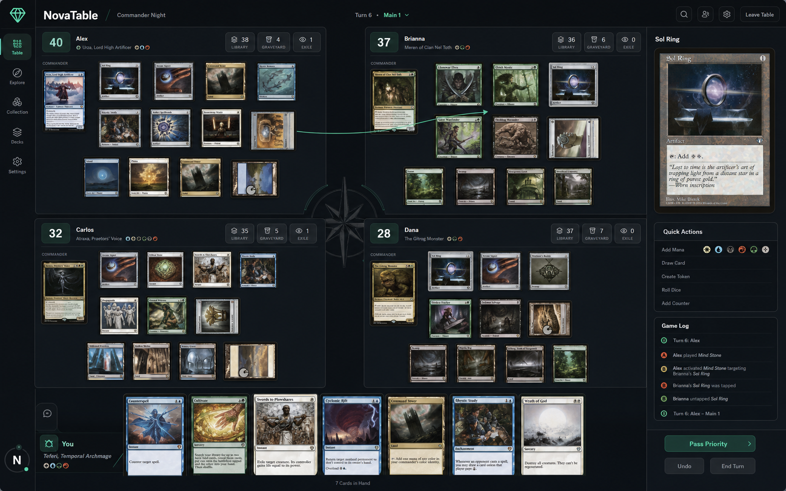

# NovaTable

NovaTable is a modern multiplayer tabletop built specifically for playing
Magic: The Gathering with friends. Players have one permanent identity and
move through Home → Friends → Lobby → Game without seeing servers, endpoints,
or transport configuration.



[Download NovaTable for Windows](https://novatable.162.243.65.125.sslip.io/) — install the current version once; later releases are downloaded and installed automatically.

The current beta is an end-to-end multiplayer vertical slice: global account,
modern home, public/private lobbies, text deck import, a four-seat Commander
pre-game room, development players, Ready/Start, and a synchronized playable
four-player board. The board supports draw, drag-to-play, tap/untap, life,
poison, commander damage/tax, counters, tokens, zone movement, shuffle, mill,
scry, mulligan, phases and turns through structured actions. Battlefield cards
store free X/Y positions and can be dragged again after entering play.

On first launch NovaTable offers to install Scryfall's Oracle Cards bulk
catalog into IndexedDB. Card metadata stays local; artwork is loaded from the
catalog URL and cached by the desktop webview when displayed.

## Run it

Requirements:

- Node.js 22 or newer
- Rust stable
- The native prerequisites required by Tauri 2

```powershell
npm install
npm run dev
```

To start the desktop shell:

```powershell
npm run desktop:dev
```

Development mode uses the local fallback unless `VITE_API_URL` is set. Create
an account, import a Commander deck, create **Commander Night**, use
**Add dev player** for the other three seats, select your deck, become Ready,
and Start Game.

Verification:

```powershell
npm test
npm run test:server
npm run build
cargo check --manifest-path src-tauri/Cargo.toml
```

## Direction

The rewrite uses:

- React + TypeScript for the interface and interaction layer
- a pure reducer/domain core for deterministic game behavior and replay
- a small Node service for global accounts, shared lobbies and an ordered game-action relay
- a local fallback for UI tests and offline development
- Tauri + Rust for the desktop shell

See [docs/product-vision.md](docs/product-vision.md),
[docs/architecture.md](docs/architecture.md). Cockatrice research remains in
the repository as a reference for useful tabletop behavior only; it is not
part of the product UX.

## Attribution and license

Cockatrice was studied as one reference for manual tabletop interactions.
NovaTable is a separate product and does not reproduce Cockatrice's UX or
server model. Cockatrice is Copyright its respective contributors and
licensed under GPL v2.

NovaTable is distributed under the GNU General Public License, version 2.
See [LICENSE](LICENSE).

NovaTable is unofficial Fan Content permitted under the Wizards of the Coast
Fan Content Policy. Not approved or endorsed by Wizards. Portions of the
materials used are property of Wizards of the Coast. © Wizards of the Coast LLC.

Magic: The Gathering and related marks, card artwork and the original card-back
image in `public/magic-card-back.png` belong to Wizards of the Coast. That asset
is not distributed under NovaTable's GPL license.
